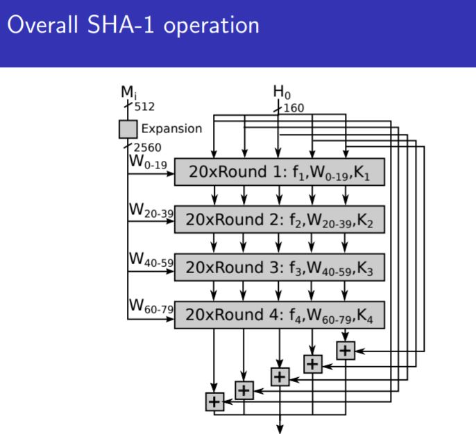
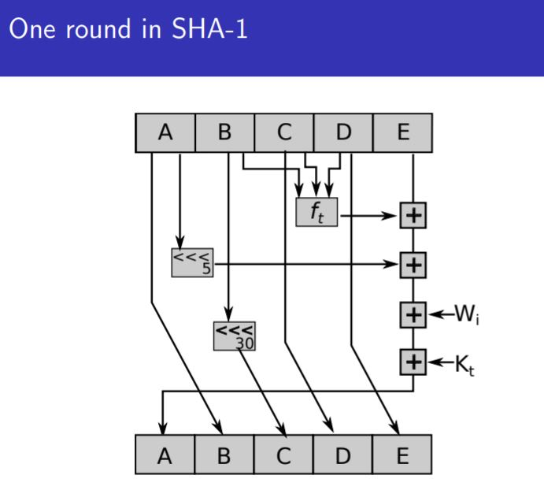

# Hash functions

Data Integrity
- Concept of maintaining the integrity of data over the internet
- Possible attacks include:
    - Data manipulation
        - jam
        - eavesdrop
        - spoof/insert

Possible attack for OTP: (Covered in lab)
- (m XOR OTP) XOR (m XOR m') = m' XOR OTP
    - This means that the message can be manipulated without knowing OTP (if message is known beforehand)
- This leads to the need for validation of **message integrity**

---
# The below shows ways to get message digest through hash functions
---
Currently to encrypt:
- Use message digest to verify contents:
    - msg (plaintext)
    - key (hash function)
    - msg digest
- **PROPERTIES OF A SECURE HASH**
    - Possible to still manipulate msg if not preimage resistant
    - preimage resistance:
        - for y = f(x):
            - hard to find x for f to produce y
            - hard to find x' such that f(x) = f(x')
    - Collision resistance:
        - Hard to find any 2 inputs x, x' for f, such that f(x) = f(x')
    - Random Oracle Property:
        - For 2 correlated inputs m1, m2, output of f is completely uncorrelated
    
---
Hash functions with above properties:
- Merkle-Damgard construction:
    - Repeated compression of collision resistant compressing function
    - uses previous output and new chunk of input
    - similar to merkle trees
- SHA-1:
    - first expanded to 2560-bits from 512 (5 times)
    - essentially 2560-bit merkle trees.
        - expanded into 80 x 32 bit words
        - original input: 512 bits
        - 4 stages, with 20 rounds of compression each stage
        - Different constants K for each stage, non-linear function ft
         
For attacker:
- Find preimages
    - harder
    - For Message Digest, if f is collision resistant, then H is collision resistant too
- Find collisions
    - easier, but less useful
         
Standard: Birthday paradox
- Due to concept of birthday paradox, found that collisions are found within effort 2^69 steps instead of 2^80
- Made SHA-1 unreliable for wealthy companies with high computational power

Conclusion:
- why block ciphers?
    - Steam ciphers do not preserve message integrity
    - hash functions designed to allow integrity validation
        - esp second preimage resistance 
         
---
Questions
---
- What does SHA-1 actually do?
    - Takes in an input of length 512 bits
    - Converts to output of 160 bits (20 byte) msg digest
- Why expand in SHA-1?
    - Padding is required to make it a multiple of 512 or 1024 bits (preprocessing)
- How to pad?
    - Add "1" to end of message
    - Add "0" for remaining
    - **last 64 bits** denote the (bit) length of the actual message
    - eg. abc = "abc" + 1 + 000.... +  (00...011000) => "l = 24"
- What happens during the "compression" step?
    - Overall:
    - 
    - Single:
    - 

- SHA-3 different from SHA-1 and SHA-2:
    - 