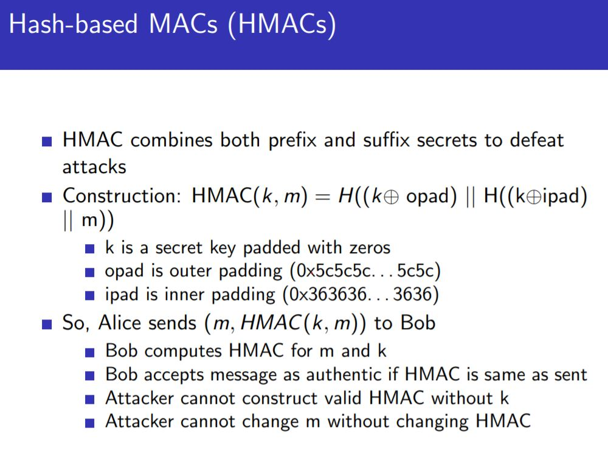

# Secure hash function

Not much different from last week
---

Authentication:
1. Identity authentication
    - identity of sender
2. Message authentication
    - valid message

- Design Challenge: Transparent Bidding
    - Assume n bidding
        - everyone can bid once
        - Bids are compared once all are given
        - Highest bid wins
    - Simpler: rock paper scissors game
    
- **IDEA**
    - Send msg digest(C) ahead first, then reveal.
    - This makes it possible to verify if the message has been changed
    - Compare if H(m) == C (sent ahead of time)
    
---

Message authentication codes (MAC)
---
- Introduce a key (secret)
- Makes it such that only actual sender can find hash
- Sent now contains (msg, tag): 
    - where tag = H(key, msg)
    - **note that key is symmetric**
    - Verifier will perform: H(k, m') == tag
    
Comparing: x = H(k||m) vs x = H(m||k)

- Vulnerabilities:
    - Attack 1: x = H(k, m)
        - find m' such that x = H(k,m||m')
        - first preimage attack 
    - Attack 2: x = H(m, k)
        - second preimage attack
    
How to solve this?
- 
    
---
Storage of secrets
---
- Security involves **redundancy**
- This is due to additional proof
- Rainbow tables can be used to direct map hashes to x

---
Collision Attacks (Square root attack)
---
- Signing of good document with a matching malicious document
- Effort needed is **sqrt(2^n)** or **2^(n/2)**
    - where n is the number of bits in the document
    - This is due to the application of birthday paradox
- This can be applied to CA certificates

---
lesson #2
---
Integity format:
- send (msg, msg')
    - msg' here is unpredictable, complete with padding
    - without padding, will be able to attack knowing the hash preimage

Authenticity of msg:
- send (msg, tag)
    - tag here is used to validate that it is from correct sender

---
How do rainbow tables work?
1. Naive implementation
    - direct mapping 1:1
    - Very large storage required
2. Hash chains
    - Store I1 + Ot (for each chain)
    - Requires a hash function and reduction function
    - For password hash x:
        - check if x == O (any):
            - if match:
                - use hashchain to f(I1) -> R(O1) -> .... -> Ot-1
            - else:
                - new_x = f(R(x)) 
                - check if new_x == O (any)
                - repeat
    
    - This works since less storage used, more computation
    - Objective would be to find if any chains contain x